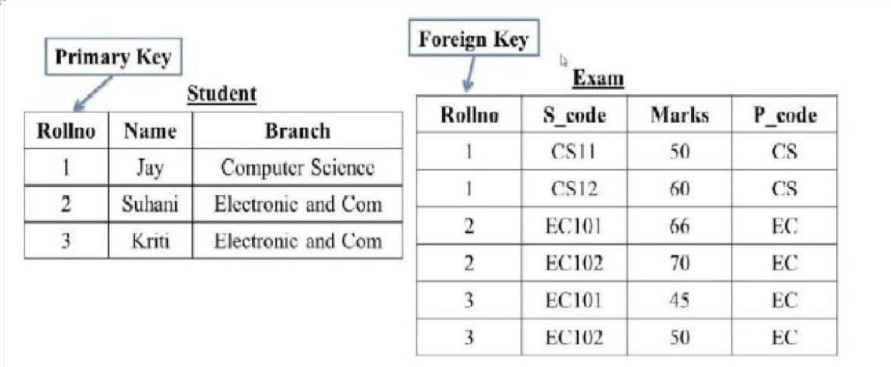

``` SQL
Q-1.
create table student
(RollNo int primary key, Name varchar(20),Branch varchar(20));

insert into student values
(1,"jay","Computer Scicnce"),
(2,"Suhani","Electronic and Com"),
(3,"Kriti","Electronic and Com");

create table Exam
(RollNo int, Foreign key (Rollno) references student (RollNo), S_code varchar(20),Marks int, P_code varchar(20));

insert into Exam values
(1,"CS11",50,"CS"),
(1,"CS12",60,"CS"),
(2,"EC101",66,"EC"),
(2,"EC102",70,"EC"),
(3,"EC101",45,"EC"),
(3,"EC102",50,"EC");

```
 