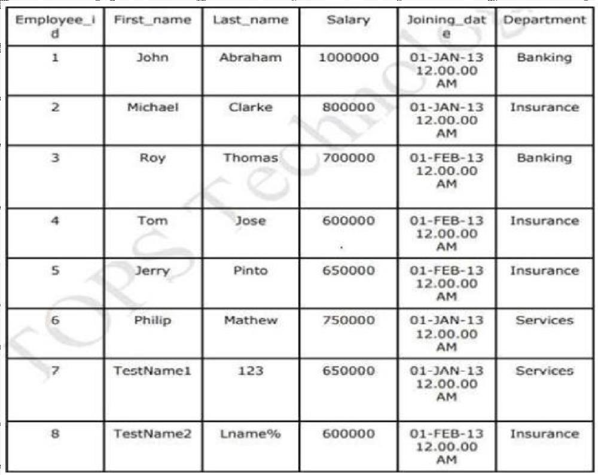
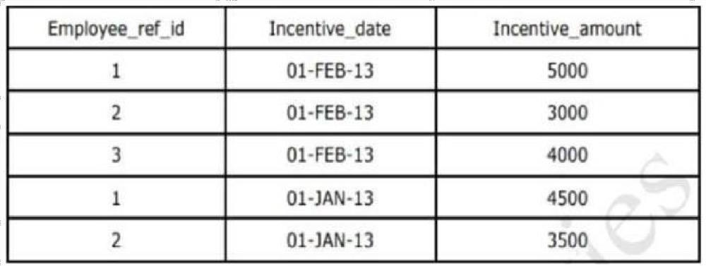

```sql
Q-2.

CREATE TABLE employee(Employee_id int,Frist_name varchar(20),Last_name varchar(20),Salary int,Joining_date datetime,Deparment varchar(30));

INSERT INTO employee VALUES
(1,'John','Abraham',1000000,'2013-01-01 12:00:00','Banking'),
(2,'Michael','Clarke',800000,'2013-01-01 12:00:00 ','Insurance'),
(3,'Roy','Thomas',700000,'2013-02-02 12:00:00','Banking'),
(4,'Tom','Jose',600000,'2013-02-02 12:00:00','Insurance'),
(5,'Jerry','Pinto',650000,'2013-02-02 12:00:00','Insurance'),
(6,'Philip','Mathew',750000,'2013-01-01 12:00:00','Services'),
(7,'TestName1','123',650000,'2013-01-01 12:00:00','Services'),
(8,'TestName2','Lname%',600000,'2013-02-02 12:00:00','Insurance');

CREATE TABLE Incentive(Employee_ref_id int,Incentive_date varchar(30),Incentive_amount varchar(30));

INSERT INTO incentive VALUES
(1,'01-FEB-13',5000),
(2,'01-FEB-13',3000),
(3,'01-FEB-13',4000),
(1,'01-JAN-13',4500),
(2,'01-JAN-13',3500);
```
